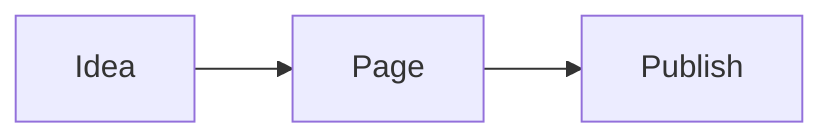

# Uvoo-MiniCMS

A deliberately small Hugo/WordPress-like CMS:

- Go backend using `connect-go` RPC over plain HTTP/JSON.
- SQLite storage with WAL enabled.
- One-user Basic Auth for `/admin/` and API endpoints.
- Public Markdown pages rendered server-side with Goldmark GFM.
- Per-content public routes such as `/`, `/about`, and `/blog/news`.
- Page/post content types plus SEO descriptions for published routes.
- Simple tags and public search across title, description, tags, and body.
- Ant Design React admin UI.
- MDXEditor WYSIWYG-style Markdown editor.
- Optional source Markdown editing mode.
- Links, images, tables, inline code, fenced code blocks, and Mermaid code fences.
- Safe rich Markdown shortcodes for Font Awesome icons and cards.
- File/image uploads inserted into Markdown.
- Global logo, favicon, top menu, public theme, and footer settings.
- IP CIDR allow/deny middleware.
- Optional MaxMind GeoIP country allow/deny middleware.
- Optional built-in TLS via cert/key files.
- SQLite-backed admin/public network ACLs in the admin UI.
- Four lightweight admin palettes with `slate` as the default.

## Layout

```text
cmd/uvoo-minicms/           server entrypoint
cmsv1connect/          tiny hand-written connect-go bindings using protobuf Struct
internal/auth/         Basic Auth + IP filter middleware
internal/config/       environment config
internal/db/           SQLite store
internal/geo/          optional MaxMind country filter
internal/service/      Connect RPC service implementation
internal/web/          public Markdown renderer
proto/cms.proto        canonical API schema
web/                   React + Ant Design admin
```

## Quick start

```bash
cp .env.example .env
# edit CMS_ADMIN_PASS before exposing the service
make run
```

Open:

- Public site: `http://localhost:8080/`
- Admin: `http://localhost:8080/admin/`

Default login is `admin` / `change-me` unless changed in `.env`.

## Non-Docker Linux Build

For a tiny tarball-style install, build the admin UI and a native Go binary on the target Linux machine:

```bash
./scripts/build.sh
./bin/uvoo-minicms
```

To create a redistributable archive:

```bash
./scripts/package.sh
# creates dist/uvoo-minicms-<version>-linux-<arch>.tar.gz
```

A user can run the archive like this:

```bash
tar -xzf uvoo-minicms-*.tar.gz
cd uvoo-minicms-*
cp .env.example .env
# edit CMS_ADMIN_PASS
./run.sh
```

The binary must be built for the same Linux libc family it will run on. Copying `/app/uvoo-minicms` out of the Alpine Docker image can fail on Ubuntu/Debian with `cannot execute: required file not found` because that container binary expects Alpine musl libraries. Use `scripts/package.sh` on the target distro, or publish separate distro-compatible tarballs.

## Linux deb/rpm Packages

For distro-style installs, this repo uses a small `nFPM` config. `nFPM` is also what GoReleaser uses for package generation, so this keeps manual packaging simple while leaving room to add GoReleaser later.

See [docs/PACKAGING.md](docs/PACKAGING.md) for package versioning, dirty builds, and verification commands.

Install `nfpm`, then run:

```bash
make package-linux
# creates .deb and .rpm packages in dist/
```

You can choose formats with:

```bash
FORMATS=deb make package-linux
FORMATS=rpm make package-linux
```

To build release assets, create/push a tag, and publish a GitHub release with those assets:

```bash
VERSION=v0.1.0 make release
```

The packages install:

- binary: `/usr/bin/uvoo-minicms`
- web assets: `/usr/share/uvoo-minicms/web/dist`
- config: `/etc/uvoo-minicms/uvoo-minicms.env`
- data/uploads: `/var/lib/uvoo-minicms`
- systemd unit: `uvoo-minicms.service`

The package creates a locked-down `uvoo-minicms` system user, generates a strong `CMS_ADMIN_PASS` when the packaged default is still present, enables the systemd service, and starts it automatically. The generated password is printed during install and stored in:

```text
/etc/uvoo-minicms/uvoo-minicms.env
```

Show it with:

```bash
sudo grep ^CMS_ADMIN_PASS= /etc/uvoo-minicms/uvoo-minicms.env
```

On upgrade, the package preserves the existing config and restarts the service. To rotate the admin password later, edit `CMS_ADMIN_PASS` and restart:

```bash
sudo editor /etc/uvoo-minicms/uvoo-minicms.env
sudo systemctl restart uvoo-minicms
```

## Docker

```bash
cp .env.example .env
# edit CMS_ADMIN_PASS
docker compose up --build
```

The Docker build uses the committed `web/package-lock.json` with `npm ci` for repeatable frontend installs.

Use modern Compose (`docker compose`, with a space). The old Python `docker-compose` v1.29.x can fail during container recreation with `KeyError: 'ContainerConfig'` on newer Docker engines. If you hit that, run:

```bash
docker compose up -d --force-recreate --remove-orphans uvoo-minicms
```

The Makefile also includes `make docker-up`, `make docker-build`, and `make docker-down` wrappers that use modern Compose.

## Content Model

Uvoo-MiniCMS keeps the editing model intentionally small:

- `Admin slug` is the stable admin identifier used by API calls.
- `Public route / SEO URL` is the published path visitors see, for example `/about/company`.
- `Type` is either `page` or `post`; both render as public Markdown routes for now.
- `SEO description` is emitted as the public page `<meta name="description">`.
- `Published` controls whether the route is visible publicly.

The `home` admin slug is reserved for `/` and cannot be deleted.

## Website Import

The admin `Import` tab can create CMS pages from an existing website URL.

- WordPress sites are imported through the public REST API when available.
- XML sitemaps are discovered through `robots.txt` and common paths such as `/sitemap.xml` and `/wp-sitemap.xml`.
- If no sitemap is available, the importer falls back to same-site links found on the homepage.
- Imported HTML content is converted to Markdown and saved as normal CMS pages/posts.
- Menu import prefers WordPress menu endpoints, then falls back to homepage navigation links.
- Existing routes are skipped by default; enable `Update existing` to overwrite matching slugs or paths.

## Site Settings

The admin `Site` tab manages simple global pieces shared by every public page:

- Logo and favicon tools that resize PNG/JPG uploads or PNG/JPG URLs and update the active site setting.
- A nested top menu builder for internal paths such as `/about` and external URLs.
- Public navigation layout selector: top menu or smooth side drawer.
- Public default theme, with a visitor-side light/dark toggle saved in the browser.
- Enable/disable switches for logo, favicon, menu, and the visitor theme toggle.
- Optional Font Awesome loading for the icon shortcode.
- Public search toggle with a menu search control and `/search?q=...` results page.

The public menu collapses into a small hamburger menu on mobile.

The admin `Footer` tab manages the global Markdown footer shown on public pages. The default footer uses the current year and site name, and can be replaced with contact details, address lines, policy links, or social profile links.

See [docs/CONTENT.md](docs/CONTENT.md) for Markdown shortcodes, including YouTube and Vimeo video embeds.
See [docs/NAVIGATION.md](docs/NAVIGATION.md) for link and section menu item behavior.

Mermaid diagrams can be written as fenced code blocks:

````markdown

````

Small rich-content cards and icons can be written without enabling raw HTML:

```markdown
Build faster {{icon:rocket}} with simple Markdown.

:::card title="Simple operations" icon="gauge-high"
Use **pages**, nested menus, uploads, and Markdown without a heavy page builder.
:::
```

Icon names map to Font Awesome solid classes, so `{{icon:rocket}}` becomes `fa-solid fa-rocket`. Advanced classes such as `{{icon:fa-brands fa-github}}` are also accepted, but only letters, numbers, spaces, and dashes are allowed.

## Config

| Variable | Default | Notes |
|---|---:|---|
| `CMS_ADDR` | `:8080` | Listen address. |
| `CMS_SITE_NAME` | `Uvoo-MiniCMS` | Public site name. |
| `CMS_ADMIN_USER` | `admin` | Basic Auth username. |
| `CMS_ADMIN_PASS` | `change-me` | Basic Auth password. Change this. |
| `CMS_DATA_DIR` | `./data` | Data root. |
| `CMS_DB` | `./data/cms.db` | SQLite DB path. |
| `CMS_UPLOAD_DIR` | `./data/uploads` | Upload directory. |
| `CMS_WEB_ROOT` | `web/dist` | Admin React build directory. Package installs normally use `/usr/share/uvoo-minicms/web/dist`. |
| `CMS_MAX_UPLOAD_BYTES` | `26214400` | Max upload size. |
| `CMS_TLS_CERT` | empty | TLS certificate file. Requires `CMS_TLS_KEY`; enables HTTPS when both are set. |
| `CMS_TLS_KEY` | empty | TLS private key file. Requires `CMS_TLS_CERT`. |
| `CMS_ALLOW_CIDRS` | empty | Comma-separated CIDRs. Empty means allow all. |
| `CMS_DENY_CIDRS` | empty | Comma-separated denied CIDRs. |
| `CMS_TRUST_PROXY_HEADERS` | `false` | Enables `CF-Connecting-IP`, `X-Real-IP`, and `X-Forwarded-For`. Only enable behind trusted reverse proxy. |
| `CMS_MAXMIND_DB` | empty | Path to GeoLite2/GeoIP2 Country `.mmdb`. Empty disables geo filtering. |
| `CMS_ALLOW_COUNTRIES` | empty | ISO country allow list, e.g. `US,CA`. Empty means allow all except denied. |
| `CMS_DENY_COUNTRIES` | empty | ISO country deny list. |

Common CLI flags mirror the most useful env vars:

```bash
uvoo-minicms -addr :8443 -db ./data/cms.db -uploads ./data/uploads \
  -web-root /usr/share/uvoo-minicms/web/dist \
  -admin-user admin -admin-pass 'change-me' \
  -allow-cidrs '203.0.113.10/32,2001:db8::/32' \
  -maxmind-db ./GeoLite2-Country.mmdb -allow-countries US,CA \
  -tls-cert ./certs/site.crt -tls-key ./certs/site.key
```

Multiple instances can share the same packaged admin React build by pointing each process at the package web root while keeping instance state separate:

```bash
uvoo-minicms -addr :8082 -db /var/lib/uvoo-minicms/site-a/cms.db -uploads /var/lib/uvoo-minicms/site-a/uploads -web-root /usr/share/uvoo-minicms/web/dist
uvoo-minicms -addr :8083 -db /var/lib/uvoo-minicms/site-b/cms.db -uploads /var/lib/uvoo-minicms/site-b/uploads -web-root /usr/share/uvoo-minicms/web/dist
```

## Security ACLs

The admin `Security` tab adds runtime rules without needing to restart:

- Admin/API and public/uploads each have a default policy: allow unless denied, or deny unless allowed.
- CIDR rules support IPv4 and IPv6, for example `203.0.113.10/32`, `198.51.100.0/24`, and `2001:db8::/32`.
- Country allow/deny fields can be scoped to admin/API or public/uploads when `CMS_MAXMIND_DB` is configured.
- Environment CIDR rules (`CMS_ALLOW_CIDRS` and `CMS_DENY_CIDRS`) still run first as a hard outer guard.

## Security notes

- Use TLS directly with `CMS_TLS_CERT`/`CMS_TLS_KEY`, or put it behind HTTPS. Basic Auth is only safe over HTTPS.
- Set a strong `CMS_ADMIN_PASS`.
- Keep `CMS_TRUST_PROXY_HEADERS=false` unless a trusted proxy strips and rewrites those headers.
- Public uploads are limited to common image/text/document extensions.
- Raw HTML in Markdown is escaped by default; use Markdown syntax for page content.

## API shape

This project uses Connect RPC endpoints but keeps the code minimal by using `google.protobuf.Struct` request/response payloads instead of generated app-specific message structs.

Example:

```bash
curl -u admin:change-me \
  -H 'Content-Type: application/json' \
  -d '{"slug":"home"}' \
  http://localhost:8080/cms.v1.CMSService/GetPage
```

## Why this design

This intentionally avoids a plugin system, themes marketplace, server-side JS, full-text search, users/roles, and complex media workflows. The core path is a few SQL queries, Markdown rendering, static upload serving, and a compact React admin.
