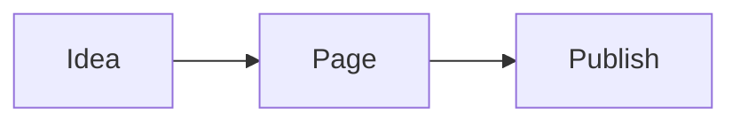

# Content Authoring

UvooMiniCMS renders public pages from Markdown and supports a small set of safe shortcodes for richer content. Raw HTML is escaped by default, so use these shortcodes instead of pasting iframe HTML.

## Video Embeds

Use video shortcodes to embed responsive YouTube and Vimeo players:

```markdown
{{youtube:dQw4w9WgXcQ}}
{{youtube:https://www.youtube.com/watch?v=dQw4w9WgXcQ}}
{{youtube:https://youtu.be/dQw4w9WgXcQ}}
{{youtube:https://www.youtube.com/shorts/dQw4w9WgXcQ}}

{{vimeo:76979871}}
{{vimeo:https://vimeo.com/76979871}}
{{vimeo:https://player.vimeo.com/video/76979871}}
```

The renderer accepts only valid YouTube video IDs or Vimeo numeric IDs from supported URL formats. Invalid values render nothing.

YouTube embeds use the privacy-enhanced `youtube-nocookie.com` host.

## Icons

Use Font Awesome icon shortcodes:

```markdown
Build faster {{icon:rocket}} with simple Markdown.
Follow us {{icon:fa-brands fa-github}}.
```

Simple names map to Font Awesome solid classes. Advanced classes are allowed when they contain only letters, numbers, spaces, and dashes.

## Cards

Use cards for highlighted content:

```markdown
:::card title="Simple operations" icon="gauge-high"
Use **pages**, nested menus, uploads, and Markdown without a heavy page builder.
:::
```

Card bodies support normal Markdown.

## Blog

Enable the blog in **Site settings**. The blog route defaults to `/blog` and lists published pages whose type is `Post`, newest first.

Common settings:

- **Blog route**: public index path, for example `/blog` or `/news`.
- **Blog menu/title**: text shown on the blog page and optional menu item.
- **Add Blog menu item**: appends a virtual menu link when no existing menu item already points at the blog route.
- **Posts per page**: caps the number of posts rendered on the blog index.

Use **New post** in the admin sidebar to start a post. New post paths default under the blog route, for example `/blog/my-post`.

Set a post's **Published date** to `YYYY-MM-DD` or RFC3339, such as `2026-06-02T12:00:00Z`, when you want explicit chronological ordering.

The public site exposes an RSS feed at:

```text
/blog/feed.xml
```

If you change the blog route to `/news`, the feed moves to `/news/feed.xml`. Public pages include an RSS discovery link when the blog is enabled.

## Revision History

Set **Revisions per page** in **Site settings**. `0` disables revision history. When the value is above zero, saving an existing page stores the previous version before applying the new one.

Use **History** in the page editor to load a previous version into the form. Loading a revision does not overwrite the current page until you press **Save**.

## Mermaid

Mermaid diagrams can be written as fenced code blocks:

````markdown

````
